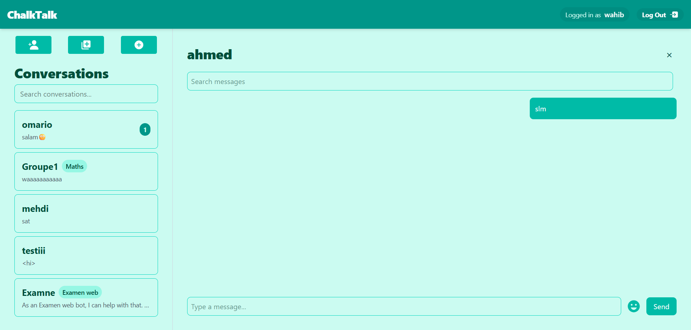

# ChalkTalk 🎓

An AI-powered real-time chat platform for collaborative learning and subject-specific discussions.

## Features ✨

- **Real-Time Messaging** 💬  
  Instant message delivery with Socket.io
- **AI-Powered Assistance** 🤖  
  @chatBot integration for subject-specific queries
- **Group Conversations** 👥  
  Create subject-specific rooms with admin controls
- **Secure Authentication** 🔐  
  JWT-based user registration/login system
- **Smart Notifications** 🔔  
  Unread message counters and @mention highlighting
- **Advanced Search** 🔍  
  Message history search and conversation filtering
- **Responsive Design** 📱  
  Mobile-first UI with Tailwind CSS
- **Message Tagging** @  
  Mention users with @username autocomplete

## Screenshots 📸



## Tech Stack 🛠️

**Frontend**  
⚛️ React | 📱 React Router | 🎨 Tailwind CSS | 🔊 Socket.io Client

**Backend**  
🚀 Node.js | 🌐 Express | 🔌 Socket.io | 🍃 MongoDB

**AI Integration**  
🧠 OpenRouter API | 🤖 Gemini 2.0 Flash

**Security**  
🔑 JWT Authentication | 🍪 HTTP-Only Cookies

## Installation 📦

1. **Clone Repository**
```bash
git clone https://github.com/yourusername/ChalkTalk.git
cd ChalkTalk
```

2. **Client Setup**
```bash
cd client
npm install
cp .env.example .env
```

3. **Server Setup**
```bash
cd ../server
npm install
cp .env.example .env
```

## Configuration ⚙️

**Client `.env`**
```env
VITE_API_BASE_URL=http://localhost:5000
VITE_SOCKET_URL=http://localhost:5000
```

**Server `.env`**
```env
MONGO_URI=mongodb://localhost:27017/chalktalk
JWT_SECRET=your_jwt_secret_key
OPENROUTER_API_KEY=your_openrouter_key
CLIENT_URL=http://localhost:5173
```

## Usage 🚀

1. **Start Development Servers**
```bash
# In server directory
npm run dev

# In client directory
npm run dev
```

2. **Key Features**
- 👤 Register/Login with secure credentials
- 🆕 Create private chats or subject-based groups
- 🔍 Search messages/conversations
- 🤖 Use @chatBot for AI-powered answers
- 📱 Responsive mobile-first interface

## API Documentation 📚

### Authentication
| Method | Endpoint       | Description          |
|--------|----------------|----------------------|
| POST   | /auth/register | Create new account   |
| POST   | /auth/login    | User authentication |
| POST   | /auth/logout   | Session termination  |

### Chat
| Method | Endpoint            | Description                     |
|--------|---------------------|---------------------------------|
| GET    | /chat/users         | Get available users            |
| GET    | /chat/conversations | Get user conversations         |
| POST   | /chat/join          | Join group conversation        |
| GET    | /chat/unread-messages | Get unread messages          |

## Deployment 🚢

1. **Frontend**  
   Deploy to Vercel/Netlify with:
   ```bash
   Build Command: npm run build
   Output Directory: client/dist
   ```

2. **Backend**  
   Deploy to Render/Heroku with:
   ```bash
   Node.js environment
   MongoDB Atlas connection
   WebSocket support enabled
   ```
